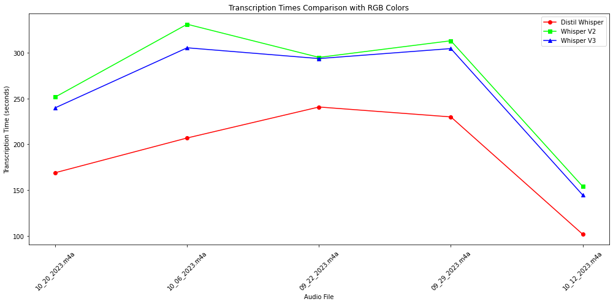
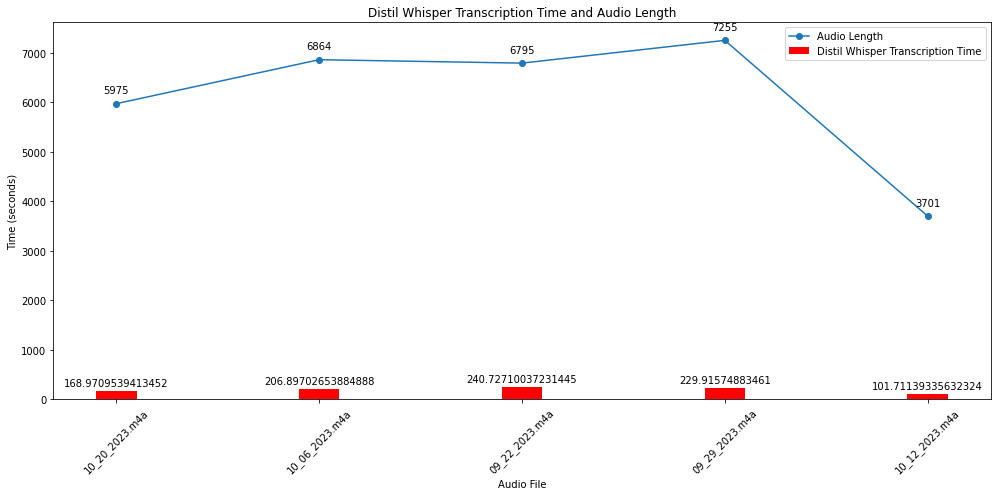
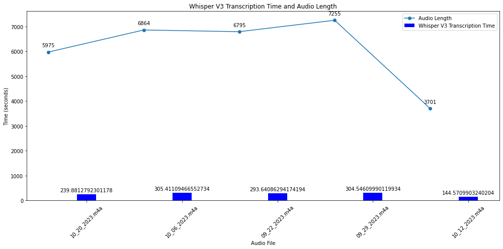
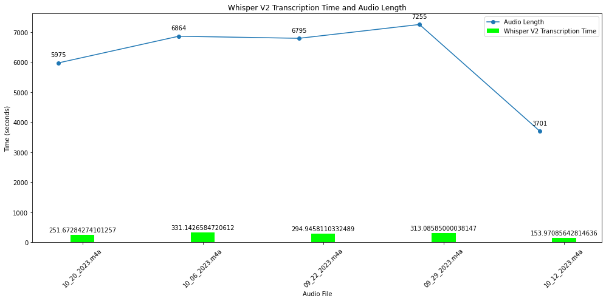

# Whisper Models Comparison Experiment

## Introduction
This repository contains the results and analysis of an experiment designed to compare the performance of three versions of  Whisper models: OpenAI Whisper v2, OpenAI Whisper v3, and Distil Whisper. The purpose of this experiment was to evaluate and compare the transcription speed of these models on a set of audio files. 

## Experiment Setup

### Audio Files
The experiment was conducted using a set of 5 audio files. These files are Zoom Audio recordings of meetings varying in length from 60 minutes to 120 minutes. The meetings were conducted in English and have [transcripts generated](https://support.zoom.com/hc/en/article?id=zm_kb&sysparm_article=KB0064927) by Zoom. As noted above, these are not completely accurate transcripts, but we will be using them to calculate Word Error Rate for Whisper generated transcripts.

### Models
The following models were used in the experiment:
- **Whisper V2:** Whisper is a pre-trained model for automatic speech recognition (ASR) and speech translation. Trained on 680k hours of labelled data, Whisper models demonstrate a strong ability to generalise to many datasets and domains without the need for fine-tuning.
Whisper was proposed in the paper [Robust Speech Recognition via Large-Scale Weak Supervision](https://arxiv.org/abs/2212.04356) by Alec Radford et al. from OpenAI. The original code repository can be found here.
Compared to the Whisper large model, the large-v2 model is trained for 2.5x more epochs with added regularization for improved performance.

- **Whisper V3:** Whisper large-v3 has the same architecture as the Whisper V2 except the following minor differences:
  - The input uses 128 Mel frequency bins instead of 80
  - A new language token for Cantonese

The Whisper large-v3 model is trained on 1 million hours of weakly labeled audio and 4 million hours of pseudo labeled audio collected using Whisper large-v2. The model was trained for 2.0 epochs over this mixture dataset.
The large-v3 model shows improved performance over a wide variety of languages, showing 10% to 20% reduction of errors compared to Whisper large-v2.

- **Distil Whisper:** Distil-Whisper was proposed in the paper Robust Knowledge Distillation via Large-Scale Pseudo Labelling.
It is a distilled version of the Whisper model that is 6 times faster, 49% smaller, and performs within 1% WER on out-of-distribution evaluation sets. This is the repository for distil-large-v2, a distilled variant of Whisper large-v2.

**Note: Distil-Whisper is currently only available for English speech recognition. Multilingual support will be provided in a follow-up.**

### Methodology
Each audio file was processed by all three models. The key focus was on assessing:
- **Transcription Speed:** The time taken by each model to transcribe each audio file.

- **Transcription Accuracy:** Comparisons on accuracy have been made using the Word Error Rate metric, However, the original transcripts of these audio files were not available for a standardized computation. Word Error Rate calculation will be provided in a separate notebook.**(Work In Progress)**

The transcription time was recorded for each model and each audio file.

## Results

In terms of processing time efficiency, the metric of interest was the time taken (in minutes) to process various audio files, compared with the actual length of these audio files.

| Audio File       | Audio Length (min) | Distil Whisper Time (min) | Whisper V3 Time (min) | Whisper V2 Time (min) |
|------------------|--------------------|---------------------------|-----------------------|-----------------------|
| 10_20_2023.m4a   | 99.583333          | 2.816183                  | 3.998021              | 4.194547              |
| 10_06_2023.m4a   | 114.400000         | 3.448284                  | 5.090185              | 5.519044              |
| 09_22_2023.m4a   | 113.250000         | 4.012118                  | 4.894014              | 4.915764              |
| 09_29_2023.m4a   | 120.916667         | 3.831929                  | 5.075768              | 5.218098              |
| 10_12_2023.m4a   | 61.683333          | 1.695190                  | 2.409517              | 2.566181              |

## Key Findings
1. Processing Efficiency Across Models:

- Distil Whisper consistently exhibited the shortest processing times across all tested audio files. The HuggingFace team reduced the number of decoder layers while keeping the encoder fixed in the original Model. Additionally, Distil Whisper has been trained on additional 22,000 hours of English audio data. 

Please note again that Distil Whisper is only available for English Speech Recognition at the time of this testing. Multilingual support will be provided in a follow up.

  
- Whisper V3 demonstrated processing times slightly less than Whisper V2 but consistently higher than Distil Whisper. This could imply a balance between model complexity and processing efficiency. 

- Whisper V2, in contrast, required noticeably longer processing times compared to Distil Whisper adn Whisper V3. Whisper V2 was the original model being tested for this experiment, with Whisper V3 and Distil Whisper being launched later. Both the new models have differences in the architecture and training data making them superior to Whisper V2

2. Correlation with Audio Length:

- There is a correlation between the audio file length and the processing time across all models. This is expected, as longer audio files have more data to be processed. However, the rate of increase in processing time relative to audio length varies between models, which could be attributed to differing efficiencies in handling larger data volumes.

3. Model Consistency:

- The variation in processing times between different runs for the same model appears minimal, indicating a level of consistency in performance. This is crucial for the reliability of the models in practical applications.

## Implications for Model Selection
The choice between these Whisper models should be informed by specific application requirements:

- For applications prioritizing English transcription and speed, Distil Whisper seems to be the optimal choice.
- Whisper V3 offers a middle ground, potentially suitable for scenarios where a transcription in other languages is a major part of the use case.
- Whisper V2 does come out slower in these comparison, However it is the only model which has smaller versions available, these smaller models can be utilized in resource constrained environments

## Conclusion

This comparative analysis can help us align model selection with specific use-case requirements. The trade-off between processing speed and transcription language is a key consideration in the deployment of machine learning models in real-world applications. Additionally, it is also important to make a note of available model sizes when working with resource constraints

## Repository Structure

- `Whisper/Whisper Comparisons.ipynb` - Jupyter Notebook containing the comparison code, and results analysis.
- `Whisper/Distil Whisper batch.ipynb` - Jupyter Notebook containing the detailed experiment, code, and results analysis for Distil Whisper
- `Whisper/Whisper V2.ipynb` -  Jupyter Notebook containing the detailed experiment, code, and results analysis for Whisper V2
- `Whisper/Whisper V3.ipynb` -  Jupyter Notebook containing the detailed experiment, code, and results analysis for Whisper V3

## How to Use This Repository

Each of the Whisper notebooks has the following variables, which can be set for reproducing the results

**MODEL_NAME :-** Set this to the HuggingFace Model Repo Name, example **"openai/whisper-large-v2"**

**audio_folder :-** Add your Audio files to this folder and set the path here. The script will take each file and pass it to Whisper one by one, example  **audio_data/**

**text_folder :-** This is where the transcripted text files will be written to, example **text_data/

**task :-** For Transcription task, leave this as **transcribe**, If you want to translate the audio files to English, set this variable to **translate**

